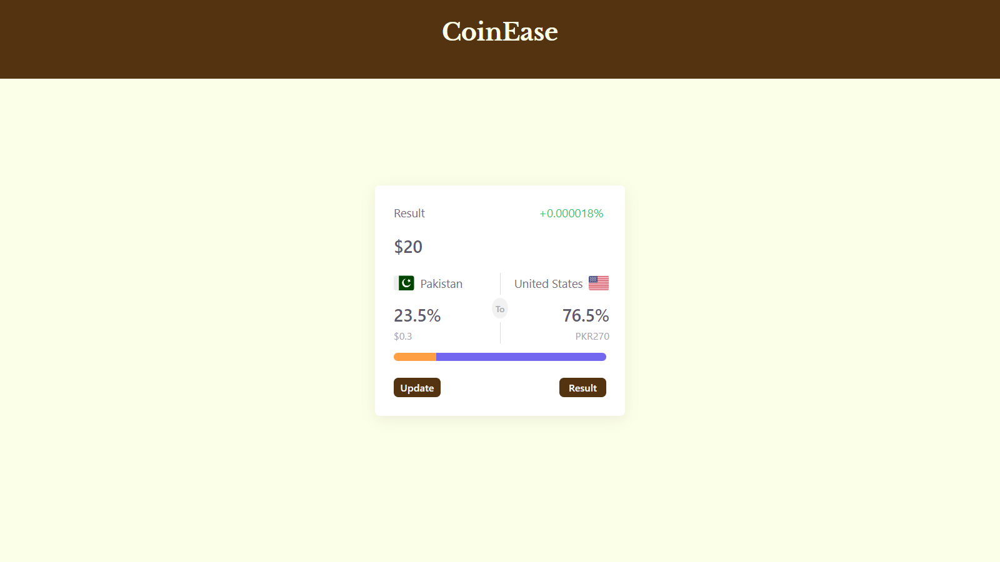

# Currency Converter App

This is a simple Currency Converter application built using React. The app allows users to convert amounts between different currencies using real-time exchange rates.

## Features

- Convert amounts between a wide range of currencies
- Real-time exchange rate data
- Intuitive and user-friendly interface
- Supports multiple conversions at once

## Screenshots


## Getting Started

### Prerequisites

Make sure you have the following installed on your local machine:

- Node.js (https://nodejs.org/)
- npm (https://www.npmjs.com/)

### Installation

1. Clone the repository:
    ```bash
    git clone https://github.com/shagufta-afzal/currency-converter-app.git
    ```
2. Navigate to the project directory:
    ```bash
    cd currency-converter-app
    ```
3. Install the dependencies:
    ```bash
    npm install
    ```

### Running the App

1. Start the development server:
    ```bash
    npm start
    ```
2. Open your browser and navigate to `http://localhost:3000` to view the app.

### Fetching Exchange Rate Data

This app uses a third-party API to fetch real-time exchange rate data. Follow these steps to set up the API:

1. Sign up for a free API key at a currency exchange rate provider like [ExchangeRate-API](https://www.exchangerate-api.com/) or [Open Exchange Rates](https://openexchangerates.org/).
2. Create a `.env` file in the root of your project and add your API key:
    ```env
    REACT_APP_API_KEY=your_api_key_here
    ```
3. In your project, use the `REACT_APP_API_KEY` environment variable to fetch data from the API. For example:
    ```javascript
    const apiKey = process.env.REACT_APP_API_KEY;
    const url = `https://api.exchangerate-api.com/v4/latest/USD?apikey=${apiKey}`;

    fetch(url)
        .then(response => response.json())
        .then(data => {
            // Handle the exchange rate data
        })
        .catch(error => {
            console.error('Error fetching exchange rate data:', error);
        });
    ```

## Built With

- [React](https://reactjs.org/) - A JavaScript library for building user interfaces
- [Create React App](https://create-react-app.dev/) - Set up a modern web app by running one command

## Contributing

Please read [CONTRIBUTING.md](CONTRIBUTING.md) for details on our code of conduct and the process for submitting pull requests.

## Acknowledgments

- Hat tip to anyone whose code was used
- Inspiration
